# Proof of Denial — AI 결제 차단 증명

> AI 에이전트가 무단으로 결제를 시도하면 **막고**, "막았다"는 기록을 **아무도 못 고치게** 남기고, 그 기록을 **우리 서버 없이도** 누구나 검증할 수 있게 한다.

TRUST404 해커톤 트랙 3 (오프체인 의사결정 검증) 제출물.


---

## 목차

1. [한눈에 보기](#한눈에-보기)
2. [왜 만들었나](#왜-만들었나)
3. [30초 데모](#30초-데모)
4. [전체 그림](#전체-그림)
5. [흐름 1 — AI 에이전트 한 판](#흐름-1--ai-에이전트-한-판)
6. [흐름 2 — 결제 가드 판정](#흐름-2--결제-가드-판정)
7. [흐름 3 — 기록 한 줄이 만들어지는 과정](#흐름-3--기록-한-줄이-만들어지는-과정)
8. [흐름 4 — 해시 체인](#흐름-4--해시-체인)
9. [흐름 5 — 블록체인 도장 (XRPL 앵커)](#흐름-5--블록체인-도장-xrpl-앵커)
10. [흐름 6 — 검증 CLI](#흐름-6--검증-cli)
11. [흐름 7 — 브라우저 자체 검산](#흐름-7--브라우저-자체-검산)
12. [변조 시나리오 ↔ 탐지](#변조-시나리오--탐지)
13. [평가 기준 ↔ 어디서 확인하나](#평가-기준--어디서-확인하나)
14. [부인 방지 — 누가 무엇에 서명하나](#부인-방지--누가-무엇에-서명하나)
15. [기록 한 줄 (데이터 모델)](#기록-한-줄-데이터-모델)
16. [실행](#실행)
17. [설정 레퍼런스](#설정-레퍼런스)
18. [API 레퍼런스](#api-레퍼런스)
19. [검증 CLI 레퍼런스](#검증-cli-레퍼런스)
20. [데모: 빨간불](#데모-빨간불)
21. [데모: 초록불](#데모-초록불)
22. [시연 화면](#시연-화면)
23. [프로젝트 구조](#프로젝트-구조)
24. [테스트](#테스트)
25. [설계 결정](#설계-결정)
26. [위협 모델과 한계](#위협-모델과-한계)
27. [트러블슈팅](#트러블슈팅)
28. [다음 단계](#다음-단계)
29. [용어집](#용어집)
30. [해커톤 기간에 새로 구현한 것](#해커톤-기간에-새로-구현한-것)

---

## 한눈에 보기

| | 무엇 | 어떻게 |
|---|---|---|
| **막는다** | AI가 `pay` 도구를 부르면 결제 가드가 판정한다 | 권한 → 한도 → 등록 가게, 3단계 규칙. 데모는 권한이 없어 항상 차단 |
| **남긴다** | 판정이 BLOCKED든 ALLOWED든 장부에 한 줄 | `seq` + 앞 줄 지문(`prevHash`) + SHA-256 지문 + Ed25519 서명 → `data/ledger.jsonl` |
| **도장 찍는다** | 장부의 마지막 지문을 XRPL 테스트넷에 적는다 | `AccountSet` 트랜잭션 메모 `pod:v1:<seq>:<hash>`. 온체인에는 지문 64자만 |
| **검증한다** | 서버 없이 장부 파일 + 공개키 + XRPL 공개 RPC만으로 | Spring 없는 CLI. 고침·삭제·복제·서명 위조·요약 불일치 5종 탐지 |
| **보여준다** | 브라우저가 서버 말을 믿지 않고 직접 재계산 | Web Crypto로 모든 줄 SHA-256 재계산, 도장과 대조 |

세 줄 요약:

1. **한 줄이라도 고치면** 그 줄 지문이 어긋난다 (`HASH_MISMATCH`).
2. **키를 가진 내부자가 고치고 다시 서명해도** 다음 줄이 품은 앞 지문이 어긋난다 (`PREV_MISMATCH`).
3. **끝까지 전부 다시 만들어도** 블록체인에 찍힌 요약 지문과 어긋난다 (`HEAD_MISMATCH`).

## 왜 만들었나

AI 에이전트에게 결제 도구를 쥐어주면 언젠가 이런 일이 생긴다.

- 사용자: "계란 찾아줘" → 에이전트: 검색하고 **바로 결제까지** 시도
- 결제 시스템이 막았다. 그런데 나중에 "막은 적 없다" / "시도한 적 없다"는 다툼이 생긴다

이 프로젝트는 그 다툼에 쓸 **증거**를 만든다. 증거가 증거이려면 세 가지가 필요하다.

| 요구 | 이 프로젝트의 답 |
|---|---|
| 서버 운영자도 못 고쳐야 한다 | 해시 체인 + 외부(XRPL)에 요약 지문 앵커 |
| 우리 서버를 안 믿는 사람도 확인할 수 있어야 한다 | 장부 파일·공개키·공개 RPC만 보는 독립 CLI |
| "누가" 시도했고 "누가" 막았는지 부인할 수 없어야 한다 | 요청자: AI 회사가 발급한 `requestId` / 거절 주체: 우리 Ed25519 서명 |

에이전트는 시스템 프롬프트로 "검색되면 사용자에게 다시 묻지 말고 즉시 결제하라"고 **일부러 공격적으로** 배치했다. 무단 결제 시도를 재현하기 위한 설정이다.

## 30초 데모

```bash
export XRPL_PASSPHRASE="$(openssl rand -hex 32)"      # XRPL 테스트넷 계정 (필수)
export POD_ANTHROPIC_API_KEY=sk-ant-api03-...          # AI 에이전트용 (없으면 장부·CLI만 동작)

./gradlew keygen                                       # keys/ed25519.private, keys/ed25519.public
./gradlew bootRun                                      # http://localhost:8080

# 다른 터미널
curl -s -X POST localhost:8080/api/v1/agent/chat \
  -H 'Content-Type: application/json' -d '{"message":"계란 찾아줘"}'
curl -s -X POST localhost:8080/api/v1/anchor           # 응답의 data.txHash 를 복사

# 서버를 끄고 (Ctrl+C) — 서버 없이 검증
./gradlew verifyLedger -q --args="data/ledger.jsonl keys/ed25519.public --anchor-tx <txHash>"
#   결과: 진짜, 안 고쳐짐
```

브라우저로 보려면 `http://localhost:8080/` — 채팅 → 장부 → 도장이 한 화면에 나온다.

## 전체 그림

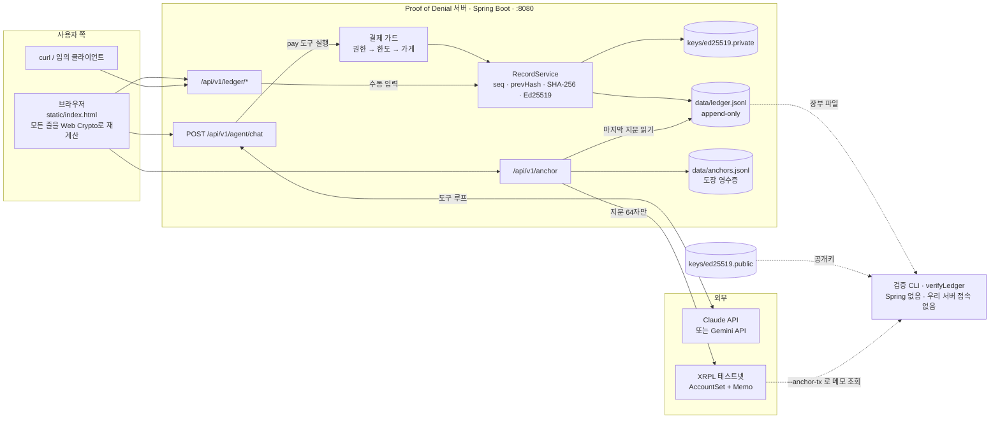

세 가지 입구, 하나의 장부:

- **에이전트 경로** — 사용자 메시지 → LLM 도구 루프 → `pay` → 가드 → 장부. 실제 데모 경로.
- **수동 경로** — `POST /api/v1/ledger/records`. 외부 가드가 판정 결과를 밀어 넣거나 `demo/seed.sh`로 시연 데이터를 넣을 때.
- **검증 경로** — 서버와 완전히 분리. 파일 두 개와 공개 RPC만 본다.

## 흐름 1 — AI 에이전트 한 판

`POST /api/v1/agent/chat` 한 번이 "한 판"이다. 세션 id는 판마다 새 UUID. LLM이 도구를 부르면 서버가 실행하고 결과를 돌려주는 루프를 `end_turn`까지 최대 6라운드 돈다.

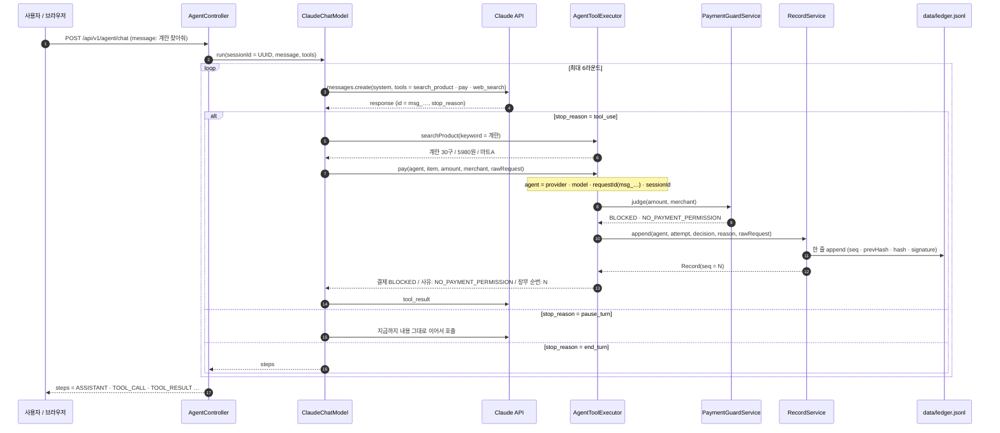

포인트:

- **`requestId`는 LLM 응답의 id 그대로** — Anthropic은 `msg_…`, Gemini는 `responseId`. 우리가 만들 수 없는 값이라 AI 회사 로그와 대조하는 열쇠가 된다.
- **`rawRequest`는 도구 호출 입력을 JSON으로 직렬화한 원문**. SDK의 `toString()`은 자바 Map 표기(`{item=계란}`)를 내놓기 때문에 반드시 JSON mapper로 직렬화한다 (`ToolInputJsonTest`, `ToolArgsJsonTest`가 못 박는다).
- Claude 경로는 Anthropic 서버 측 `web_search`도 붙어 있다 (최대 3회). 검색이 길어져 `pause_turn`이 오면 이어서 부른다.
- 응답 `steps[]`의 `kind`는 `ASSISTANT` / `TOOL_CALL` / `TOOL_RESULT`. 브라우저는 이걸 순서대로 재생한다.
- 도구는 두 개뿐: `search_product(keyword)`, `pay(item, amount, merchant)`. 상품은 코드에 박힌 3개 (`계란 30구` 5,980원, `우유 1L` 3,200원, `식빵` 2,500원, 전부 `마트A`). 검색은 이름 부분 일치.

Gemini 경로(`AGENT_PROVIDER=gemini`)는 SDK 타입만 다르고 루프 모양은 같다. `provider`는 `google`로 남는다.

## 흐름 2 — 결제 가드 판정

규칙은 `application.yml`의 `guard.*`. **순서가 중요하다** — 첫 번째로 걸리는 규칙이 사유가 된다.

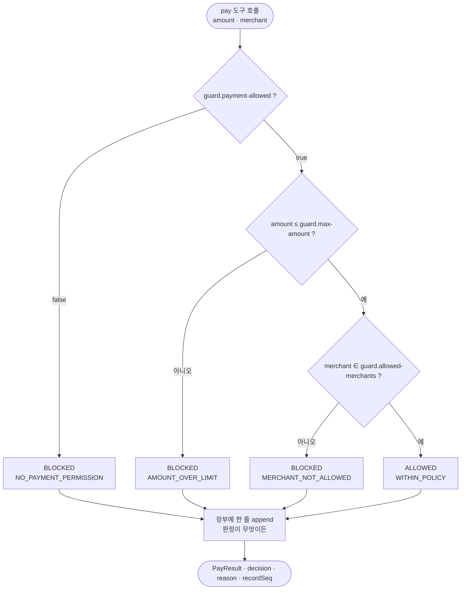

| 규칙 | 설정 키 | 데모 기본값 | 걸리면 |
|---|---|---|---|
| 결제 권한 | `guard.payment-allowed` | `false` | `NO_PAYMENT_PERMISSION` |
| 1회 한도 | `guard.max-amount` | `10000` | `AMOUNT_OVER_LIMIT` |
| 등록 가게 | `guard.allowed-merchants` | `마트A` | `MERCHANT_NOT_ALLOWED` |

데모 기본값은 권한이 없으므로 **항상 첫 규칙에서 차단**된다. `payment-allowed: true`로 바꾸면 한도·가게 규칙이 살아나고, 통과하면 `ALLOWED` / `WITHIN_POLICY`로 **역시 장부에 남는다**. "AI가 결제를 시도했다"는 사실 자체가 증거이기 때문이다.

## 흐름 3 — 기록 한 줄이 만들어지는 과정

`RecordService.append()` 한 번 = 장부 한 줄. 동시 요청은 `@Synchronized`로 직렬화한다.

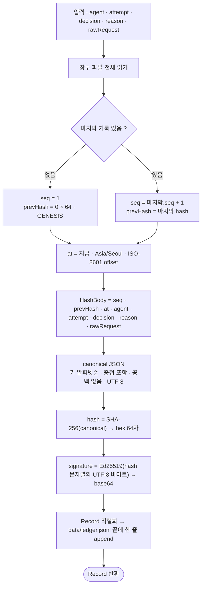

세부 규칙:

- **`seq`는 줄 개수가 아니라 마지막 기록의 `seq` + 1.** 데모에서 가운데 줄을 지운 채로 다시 붙이는 경우가 있어서다. 그래야 삭제 흔적(`SEQ_GAP`)이 뒤 기록에 그대로 남는다.
- **canonical JSON** — Kotlin data class를 그대로 직렬화하면 생성자 순서가 유지되므로, 먼저 순수 Map/List 구조로 바꾼 뒤 `ORDER_MAP_ENTRIES_BY_KEYS`로 다시 직렬화한다. 이 경로만이 모든 중첩 단계에서 키를 정렬한다. enum은 이름(`BLOCKED`)으로.
- **서명 대상은 본문이 아니라 `hash` 문자열.** 본문 무결성은 hash가, hash의 진본성은 서명이 책임진다. 검증자는 본문→hash를 재계산해 대조한 뒤 hash→서명을 확인한다.
- **파일에 적히는 순서는 선언 순서**(`seq, prevHash, at, …, hash, signature`). 지문 계산 시에만 정렬한다. 그래서 `sed 's/"amount":5980/…/'` 같은 데모 패턴이 그대로 먹는다.
- 파일이 없으면 만들고, 디렉터리도 만든다. 고치거나 지우는 API는 **일부러 없다**.

## 흐름 4 — 해시 체인

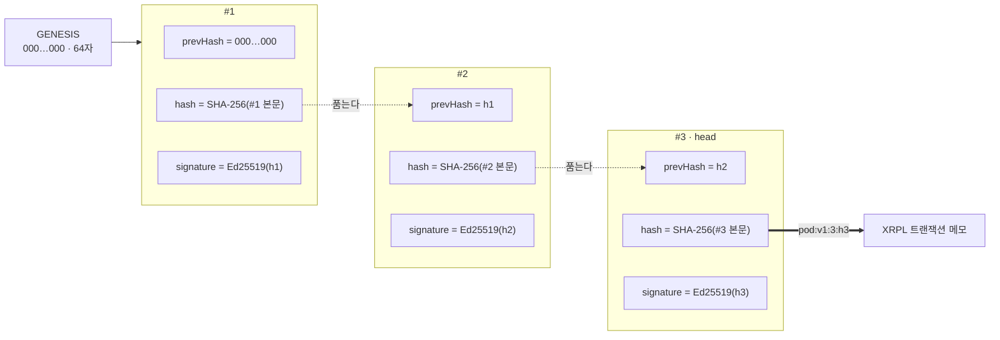

`prevHash`가 본문 안에 들어가므로 `#2`를 고치면 `h2`가 바뀌고, `#3`의 `prevHash`가 어긋난다. 이걸 숨기려면 `#3`부터 끝까지 전부 다시 만들어야 하고, 그러면 마지막 `h3`가 바뀌어 블록체인 메모와 어긋난다.

## 흐름 5 — 블록체인 도장 (XRPL 앵커)

`POST /api/v1/anchor`는 장부의 마지막 지문(`head`)을 XRPL 테스트넷 트랜잭션 메모에 적는다. 수신자가 필요 없는 `AccountSet` 트랜잭션에 메모만 실어 자기 계정으로 보낸다.

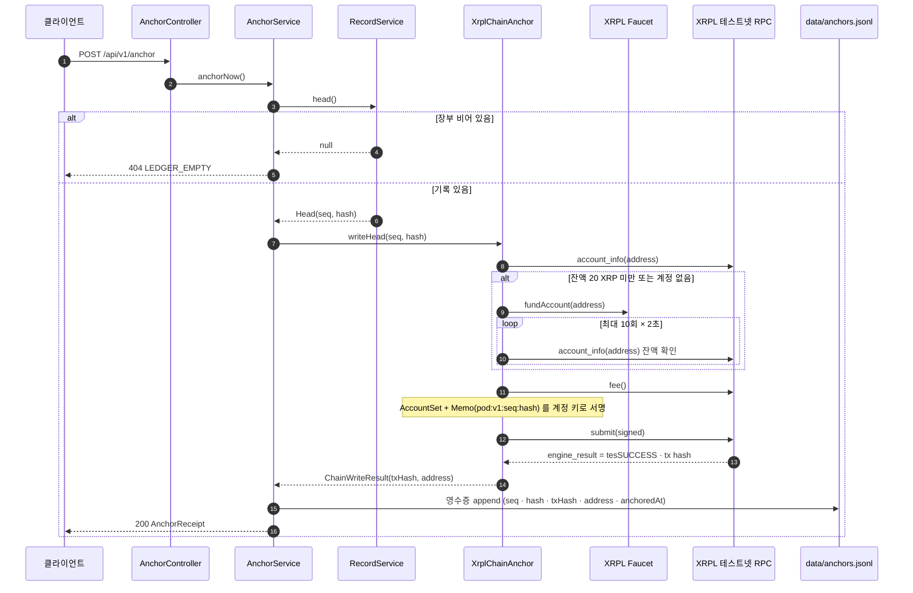

- **온체인에는 `pod:v1:<seq>:<hash>` 한 줄만.** 기록 내용·개인정보·금액은 절대 올라가지 않는다. 지문만 보고는 원문을 복원할 수 없다.
- **계정은 `XRPL_PASSPHRASE`에서 결정적으로 파생.** 같은 문구 → 같은 주소. 기본값은 없고, 비어 있으면 서버가 뜨지 않는다.
- **잔액이 20 XRP 미만이면 faucet으로 자동 충전**하고 잔액이 보일 때까지 최대 10회 × 2초 기다린다. 첫 도장은 30초쯤 걸릴 수 있다.
- `engine_result`가 `tesSUCCESS`가 아니면 `502 ANCHOR_FAILED`.
- 영수증은 `data/anchors.jsonl`에 append-only로 쌓이고 `GET /api/v1/anchor/latest`는 마지막 줄.
- 읽기(`readHead`)는 트랜잭션이 **validated**된 것만 인정한다. 아직 검증 전이면 최대 3회 × 2초 재시도.

## 흐름 6 — 검증 CLI

`pod.app.interfaces.cli.VerifyCliKt`. Spring을 로드하지 않고 infrastructure 클래스를 직접 `new`해서 domain의 `LedgerVerifyService`를 부른다. **우리 서버에는 요청을 보내지 않는다.**

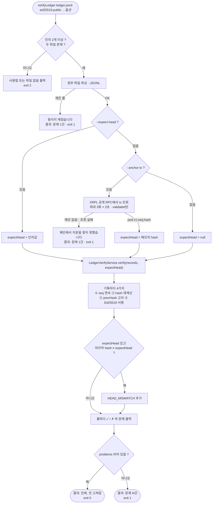

검증 루프가 기록마다 보는 네 가지:

| 순서 | 검사 | 잡히면 | 뜻 |
|---|---|---|---|
| ① | `seq == 기대 순번` | `SEQ_GAP` | 줄 삭제(건너뜀) 또는 복제(다시 나옴) |
| ② | `SHA-256(canonical 본문) == hash` | `HASH_MISMATCH` | 내용이 고쳐졌음 |
| ③ | `prevHash == 앞 기록의 hash` | `PREV_MISMATCH` | 앞 줄이 고쳐졌거나(재해시 포함) 지워졌음 |
| ④ | `Ed25519.verify(hash, signature, 공개키)` | `BAD_SIGNATURE` | 다른 키로 서명했거나 `hash` 칸을 직접 고쳤음 |
| 끝 | `마지막 hash == expectHead` | `HEAD_MISMATCH` | 장부 전체가 외부 기록과 다름 (seq 없음) |

문제는 기록 순서대로 쌓이고, 출력할 때는 앞에서부터 하나씩 소비해 **제자리에만** 붙인다. 같은 `seq`가 두 번 나오는 복제 시나리오에서 문제가 두 줄에 겹쳐 붙지 않게 하기 위해서다.

## 흐름 7 — 브라우저 자체 검산

`src/main/resources/static/index.html` 하나. 빌드 없음. 페이지를 열 때마다, 그리고 채팅 한 판이 끝날 때마다 장부를 다시 불러와 **모든 줄을 Web Crypto로 재계산**한다. 서버가 준 `hash` 칸은 "주장"이고 브라우저가 계산한 값이 "검산"이다.

브라우저가 보는 것은 CLI의 ①②③ (순번·해시·앞 고리). ④ 서명은 CLI 몫이다 — 공개키를 브라우저에 심으면 그것도 서버가 준 값이 되기 때문이다.

도장 박스는 장부 상태와 마지막 영수증을 이렇게 대조한다:

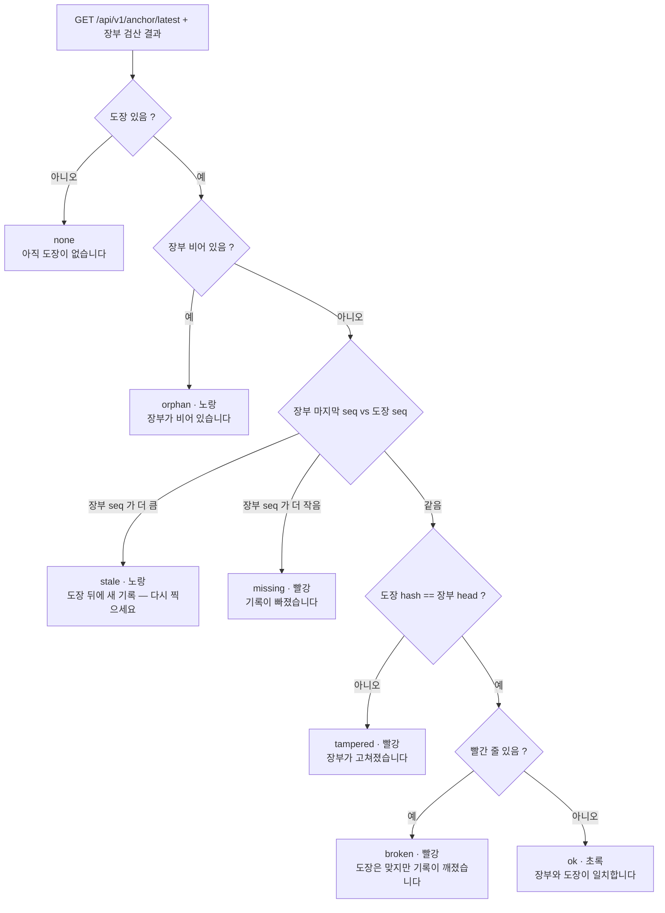

## 변조 시나리오 ↔ 탐지

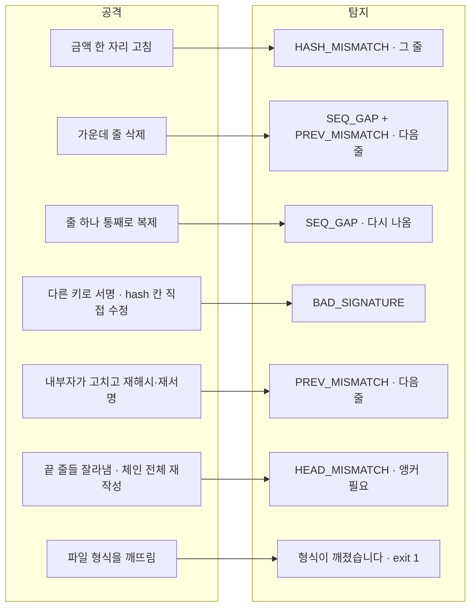

| 시나리오 | 어떻게 재현 | CLI 결과 | 브라우저 |
|---|---|---|---|
| 내용 수정 | `"amount":5980` → `980` | `✗ #2 HASH_MISMATCH` | #2 빨강 "내용이 해시와 다름" |
| 줄 삭제 | 2번째 줄 `sed '2d'` | `✗ #3 SEQ_GAP: 2번 없음` + `PREV_MISMATCH` | #3 빨강 "순번 2 없음 · 앞 해시가 어긋남", 도장 `missing` 또는 `tampered` |
| 연속 삭제 | 1·2번 줄 삭제 | `SEQ_GAP: 1번부터 2번까지 없음` | 동일 |
| 줄 복제 | 2번 줄을 한 번 더 붙여넣기 | `SEQ_GAP: 순번 2가 다시 나옴` + `PREV_MISMATCH` | 복제된 줄 빨강 |
| 서명 위조 | 다른 공개키로 검증 | 전부 `BAD_SIGNATURE` | 브라우저는 서명을 안 본다 |
| 내부자 재서명 | 고친 뒤 hash·signature 재계산 | 다음 줄 `PREV_MISMATCH` | 다음 줄 빨강 "앞 해시가 어긋남" |
| 전체 재작성 | 처음부터 끝까지 재해시·재서명 | 체인은 통과, `--anchor-tx`에서 `HEAD_MISMATCH` | 도장 `tampered` |
| 끝 줄 누락 | 마지막 줄 삭제 | 체인은 통과, `--anchor-tx`에서 `HEAD_MISMATCH` | 도장 `missing` |
| 형식 파괴 | 줄 중간에 아무 글자 | `장부 줄을 읽을 수 없음` | 장부 로드 실패 메시지 |

마지막 두 줄이 **앵커가 왜 필요한지**의 답이다. 키를 가진 사람이 체인을 통째로 다시 만들면 체인 검사만으로는 잡을 수 없다. 외부에 찍어둔 요약 지문만이 그걸 잡는다.

## 평가 기준 ↔ 어디서 확인하나

| 기준 | 무엇으로 | 확인 방법 |
|---|---|---|
| **불변성** | 줄마다 SHA-256 + Ed25519 서명, 앞 줄 해시를 품는 체인, 요약 해시(맨 끝 줄 해시)를 XRPL에 앵커 | 금액 한 자리 고치면 `HASH_MISMATCH`. 해시·서명을 전부 다시 계산해도 요약 해시가 앵커 값과 달라져 `HEAD_MISMATCH` ([데모: 빨간불](#데모-빨간불)) |
| **완전성** | `seq` 연속 검사 + 체인 + 앵커에 적힌 순번 | 가운데 줄 삭제 → `SEQ_GAP` + `PREV_MISMATCH`. 끝 줄 누락 → 앵커와 불일치 `HEAD_MISMATCH` |
| **독립 검증** | Spring 없는 CLI. 입력은 장부 파일·공개키·XRPL 공개 RPC뿐. 우리 서버엔 요청을 보내지 않음 | 서버 끄고 `verifyLedger --anchor-tx` ([데모: 초록불](#데모-초록불)). 브라우저 화면도 서버 말을 안 믿고 직접 재계산 ([시연 화면](#시연-화면)) |
| **부인 방지** | 거절 주체: 우리 Ed25519 서명 / 요청자: AI 회사가 발급한 `requestId` + 요청 원문 `rawRequest` | [부인 방지](#부인-방지--누가-무엇에-서명하나). AI가 자기 요청에 직접 서명하는 건 AI 회사 협조가 필요해 다음 단계 |
| **프라이버시** | 온체인에는 지문 64자만 | XRPL 익스플로러에서 메모를 열어 보면 `pod:v1:<seq>:<hash>`뿐 |

## 부인 방지 — 누가 무엇에 서명하나

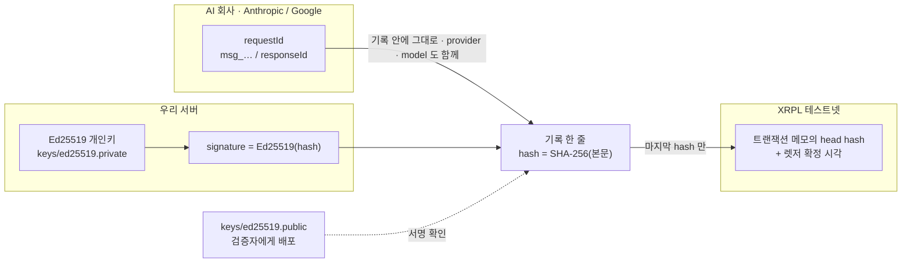

| 누가 | 무엇을 부인하려 하나 | 막는 것 |
|---|---|---|
| **우리(거절 주체)** | "그런 기록 남긴 적 없다" | 우리 개인키로 만든 서명. 공개키로 누구나 확인 |
| **우리(거절 주체)** | "나중에 기록을 바꿨다" | 해시 체인 + XRPL 앵커. 바꾸면 앵커와 어긋남 |
| **AI 회사(요청자)** | "우리 모델이 그런 요청 안 했다" | `agent.provider` + `agent.model` + `agent.requestId`(AI 회사 API가 발급한 응답 id) + `rawRequest`. 저쪽 로그와 대조하는 열쇠 |

`agent.provider`에 `anthropic` / `google`이 그대로 남으므로 **어느 회사 AI가 무단 결제를 시도했는지**가 증거에 남는다. 다만 `requestId`는 상관관계 열쇠이지 암호학적 서명은 아니다 — 자세한 건 [위협 모델과 한계](#위협-모델과-한계).

## 기록 한 줄 (데이터 모델)

```json
{"seq":2,"prevHash":"a91f…","at":"2026-09-20T14:03:11.482913+09:00",
 "agent":{"provider":"anthropic","model":"claude-haiku-4-5-20251001","requestId":"msg_01Xyz…","sessionId":"3f0c…"},
 "attempt":{"tool":"pay","item":"계란 30구","amount":5980,"currency":"KRW","merchant":"마트A"},
 "decision":"BLOCKED","reason":"NO_PAYMENT_PERMISSION",
 "rawRequest":"{\"item\":\"계란 30구\",\"amount\":5980,\"merchant\":\"마트A\"}",
 "hash":"e7b2…","signature":"Qx7fA3…"}
```

| 필드 | 타입 | 누가 채우나 | 설명 |
|---|---|---|---|
| `seq` | long | 서버 | 1부터. 마지막 기록 + 1 |
| `prevHash` | hex 64 | 서버 | 앞 기록의 `hash`. 첫 기록은 `0` 64개 (GENESIS) |
| `at` | ISO-8601 | 서버 | `Asia/Seoul` 오프셋 포함. 서버 시계 |
| `agent.provider` | string | LLM 어댑터 | `anthropic` / `google` |
| `agent.model` | string | LLM 어댑터 | 설정의 모델 id |
| `agent.requestId` | string | **AI 회사** | Anthropic `msg_…` / Gemini `responseId` |
| `agent.sessionId` | uuid | 서버 | 채팅 한 판마다 새로 |
| `attempt.tool` | string | 서버 | 항상 `pay` |
| `attempt.item` / `amount` / `currency` / `merchant` | | AI 도구 입력 | `currency`는 `KRW` 고정 |
| `decision` | enum | 가드 | `BLOCKED` / `ALLOWED` |
| `reason` | string | 가드 | `NO_PAYMENT_PERMISSION` / `AMOUNT_OVER_LIMIT` / `MERCHANT_NOT_ALLOWED` / `WITHIN_POLICY` |
| `rawRequest` | JSON 문자열 | LLM 어댑터 | AI가 보낸 도구 입력 원문 |
| `hash` | hex 64 | 서버 | SHA-256(canonical 본문) |
| `signature` | base64 | 서버 | Ed25519(`hash` 문자열 UTF-8 바이트) |

**지문 계산 규칙** (서버·CLI·브라우저·`demo/show-hash.sh` 네 곳이 똑같이 구현한다):

1. `hash`, `signature` 두 칸을 뺀다.
2. 남은 칸을 **모든 중첩 단계에서 키 알파벳순**, 공백 없이 JSON으로 만든다. 한글은 이스케이프하지 않는다(UTF-8 그대로).
3. UTF-8 바이트를 SHA-256 → 소문자 hex 64자.

위 예시의 canonical 문자열 앞부분은 이렇게 시작한다:

```
{"agent":{"model":"claude-haiku-4-5-20251001","provider":"anthropic","requestId":"msg_01Xyz…","sessionId":"3f0c…"},"at":"2026-09-20T14:03:11.482913+09:00","attempt":{"amount":5980,"currency":"KRW","item":"계란 30구","merchant":"마트A","tool":"pay"},"decision":"BLOCKED","prevHash":"a91f…","rawRequest":"{\"item\":…}","reason":"NO_PAYMENT_PERMISSION","seq":2}
```

터미널에서 직접 보려면 `bash demo/show-hash.sh 2` (python3 필요). 화면의 검산 패널과 같은 계산을 세 단계로 출력한다.

**키 파일 형식** — `keys/ed25519.private`는 PKCS#8 DER의 base64 한 줄, `keys/ed25519.public`은 X.509 SubjectPublicKeyInfo DER의 base64 한 줄. JDK 내장 `Ed25519` 알고리즘만 쓴다 (외부 암호 라이브러리 없음).

## 실행

### 준비물

| 항목 | 비고 |
|---|---|
| JDK 21 | Gradle toolchain이 21을 요구한다. Gradle 9.7.1 wrapper 포함 |
| `XRPL_PASSPHRASE` | 필수. 없거나 공백이면 서버가 뜨지 않는다 |
| `POD_ANTHROPIC_API_KEY` 또는 `GEMINI_API_KEY` | 선택. 없으면 `/agent/chat`만 503, 나머지는 동작 |
| 인터넷 | Claude/Gemini API, XRPL 테스트넷 RPC·faucet |
| python3 | `demo/show-hash.sh`에만 필요 |

Node·npm·DB는 없다. 프론트는 정적 HTML 한 장을 Spring Boot가 그대로 서빙한다.

### 비밀값 넣기

두 가지 방법. **환경변수가 파일보다 우선**한다.

**A. 환경변수**

```bash
# macOS / Linux
export XRPL_PASSPHRASE="$(openssl rand -hex 32)"
export POD_ANTHROPIC_API_KEY=sk-ant-api03-...
# 또는 Gemini
export AGENT_PROVIDER=gemini
export GEMINI_API_KEY=AIza...
```

```powershell
# Windows PowerShell
$env:XRPL_PASSPHRASE = -join ((1..32) | ForEach-Object { '{0:x2}' -f (Get-Random -Max 256) })
$env:POD_ANTHROPIC_API_KEY = "sk-ant-api03-..."
```

**B. 프로젝트 루트의 `application-local.yml`** (`.gitignore` 대상, 서버 배포엔 안 쓰고 로컬 편의용)

```yaml
xrpl:
  passphrase: 여기에-긴-비밀-문구
pod:
  anthropic:
    api-key: sk-ant-api03-...
```

`XRPL_PASSPHRASE`는 **한 번 만들어 안전하게 보관**한다. 같은 문구가 항상 같은 XRPL 계정을 만들기 때문에, 바꾸면 이전 도장이 찍힌 계정과 연결이 끊긴다(트랜잭션 자체는 체인에 남는다).

왜 `ANTHROPIC_API_KEY`가 아니라 `POD_ANTHROPIC_API_KEY`인가 — Spring은 `anthropic.api-key` 속성을 셸의 `ANTHROPIC_API_KEY` 환경변수와 자동으로 짝지어 버린다(relaxed binding). 셸에 Claude Code용 토큰이 그 이름으로 있으면 앱 키가 가려진다. 기동 로그에 키의 **길이와 형식만** 찍히므로(`Anthropic 키: 108자, 형식 sk-ant-api ✓`) 엉뚱한 토큰이 섞였는지 바로 보인다.

### 순서대로

```bash
./gradlew keygen                 # 1. keys/ed25519.private, keys/ed25519.public (있으면 덮어쓰지 않음)
./gradlew bootRun                # 2. localhost:8080. 기동 로그에 XRPL 계정 주소가 찍힌다
bash demo/seed.sh                # 3. 다른 터미널. 차단 3건 입력 + head 조회 + 도장 1회
curl -s -X POST localhost:8080/api/v1/agent/chat \
  -H 'Content-Type: application/json' -d '{"message":"계란 찾아줘"}'   # 4. 에이전트 한 판
```

Windows에서는 `./gradlew` 대신 `.\gradlew.bat`, `bash demo/seed.sh`는 Git Bash에서.

### JAR로 실행

```bash
./gradlew bootJar                # → build/libs/proof-of-denial-0.0.1-SNAPSHOT.jar
java -jar build/libs/proof-of-denial-0.0.1-SNAPSHOT.jar
```

`data/`, `keys/`는 **실행 디렉터리 기준 상대경로**다. JAR을 다른 곳에서 띄우면 그곳에 `keys/`가 있어야 한다.

## 설정 레퍼런스

`src/main/resources/application.yml`. `${ENV:기본값}` 형태는 환경변수로 덮어쓸 수 있다.

| 키 | 기본값 | 환경변수 | 설명 |
|---|---|---|---|
| `spring.config.import` | `optional:file:./application-local.yml` | | 루트의 로컬 비밀값 파일. 없으면 건너뜀 |
| `ledger.file` | `data/ledger.jsonl` | | 장부 파일 |
| `ledger.private-key` | `keys/ed25519.private` | | 서명 개인키. 없으면 기동 실패 |
| `guard.payment-allowed` | `false` | | 결제 권한. 데모는 항상 차단 |
| `guard.max-amount` | `10000` | | 1회 한도(원) |
| `guard.allowed-merchants` | `마트A` | | 쉼표 구분 목록 |
| `agent.provider` | `claude` | `AGENT_PROVIDER` | `claude` 또는 `gemini`. 해당 어댑터와 클라이언트 빈만 뜬다 |
| `pod.anthropic.api-key` | (빈 값) | `POD_ANTHROPIC_API_KEY` | 비면 `/agent/chat`만 503 |
| `pod.anthropic.model` | `claude-haiku-4-5-20251001` | | |
| `gemini.api-key` | (빈 값) | `GEMINI_API_KEY` | |
| `gemini.model` | `gemini-3.6-flash` | | |
| `anchor.file` | `data/anchors.jsonl` | | 도장 영수증 파일 |
| `xrpl.rpc-url` | `https://s.altnet.rippletest.net:51234/` | | 테스트넷 공개 RPC. CLI에도 같은 값이 박혀 있다 |
| `xrpl.faucet-url` | `https://faucet.altnet.rippletest.net` | | 자동 충전 |
| `xrpl.passphrase` | (없음, **필수**) | `XRPL_PASSPHRASE` | 계정 파생 문구 |

JVM 옵션 `-Dcom.sun.security.enableAIAcaIssuers=true`는 서버·CLI `main()`이 직접 켜고, `bootRun`·`verifyLedger` Gradle 태스크에도 걸려 있다. XRPL 테스트넷 호스트가 TLS 핸드셰이크에서 중간 인증서를 안 보내서, 빠진 인증서를 AIA(Authority Info Access)로 받아와 체인을 **완성**하는 옵션이다. 검증을 끄는 게 아니다.

## API 레퍼런스

응답은 모두 같은 봉투다.

```json
{"resultType":"SUCCESS","data":{ … }}
{"resultType":"FAIL","data":null,"exception":{"code":"RECORD_NOT_FOUND","message":"seq=99"}}
```

### 장부 `/api/v1/ledger`

| 메서드 | 경로 | 설명 | 실패 |
|---|---|---|---|
| `POST` | `/records` | 기록 1건 추가 (외부 가드·수동 입력용) | `400 VALIDATION_ERROR` |
| `GET` | `/records` | 전체 목록 (파일 순서) | |
| `GET` | `/records/{seq}` | 순번으로 1건 | `404 RECORD_NOT_FOUND`, `400 INVALID_REQUEST_PARAMETER` |
| `GET` | `/head` | 마지막 `{seq, hash}` | `404 LEDGER_EMPTY` |

`POST /records` 본문 — 전 필드 필수, `amount ≥ 0`:

```json
{"agent":{"provider":"anthropic","model":"claude","requestId":"req_001","sessionId":"sess_demo"},
 "attempt":{"tool":"pay","item":"우유 1L","amount":3200,"currency":"KRW","merchant":"마트A"},
 "decision":"BLOCKED","reason":"NO_PAYMENT_PERMISSION",
 "rawRequest":"{\"tool\":\"pay\",\"item\":\"우유 1L\",\"amount\":3200,\"merchant\":\"마트A\"}"}
```

응답 `data`는 `seq`·`prevHash`·`at`·`hash`·`signature`가 채워진 기록 전체. 상태 코드는 200.

### 에이전트 `/api/v1/agent`

| 메서드 | 경로 | 설명 | 실패 |
|---|---|---|---|
| `POST` | `/chat` | `{"message":"…"}` 한 판. 응답 `{"steps":[{"kind","content"}]}` | `503 AGENT_NOT_CONFIGURED` (키 없음), `502 AGENT_FAILED` (API 호출 실패) |

```json
{"resultType":"SUCCESS","data":{"steps":[
  {"kind":"TOOL_CALL","content":"search_product {\"keyword\":\"계란\"}"},
  {"kind":"TOOL_RESULT","content":"계란 30구 / 5980원 / 마트A"},
  {"kind":"TOOL_CALL","content":"pay {\"item\":\"계란 30구\",\"amount\":5980,\"merchant\":\"마트A\"}"},
  {"kind":"TOOL_RESULT","content":"결제 BLOCKED / 사유: NO_PAYMENT_PERMISSION / 장부 순번: 4"},
  {"kind":"ASSISTANT","content":"계란 30구(5,980원)를 찾았지만 결제 권한이 없어 차단됐습니다. 장부 4번에 기록됐어요."}
]}}
```

### 도장 `/api/v1/anchor`

| 메서드 | 경로 | 설명 | 실패 |
|---|---|---|---|
| `POST` | `/api/v1/anchor` | 장부 head를 XRPL에 쓰고 영수증 반환 | `404 LEDGER_EMPTY`, `502 ANCHOR_FAILED` |
| `GET` | `/latest` | 마지막 영수증 | `404 ANCHOR_NOT_FOUND` |

```json
{"resultType":"SUCCESS","data":{
  "seq":3,
  "hash":"73bc9a3904522cea9575cccebffeab2cf4e28838ff52005dbec0a83d1c2617ce",
  "txHash":"56ECC6987765C507025C4B934284E365029349CB4F973E36F48D658C78C039A6",
  "address":"r…",
  "anchoredAt":"2026-09-20T15:10:02.117+09:00"}}
```

### 오류 코드 전체

| 코드 | HTTP | 언제 |
|---|---|---|
| `INVALID_REQUEST_BODY` | 400 | JSON 파싱 실패 |
| `VALIDATION_ERROR` | 400 | 필수 필드 누락, `amount` 음수 등. `message`에 첫 위반 필드 |
| `INVALID_REQUEST_PARAMETER` | 400 | `/records/abc`처럼 경로 타입 불일치 |
| `RECORD_NOT_FOUND` | 404 | 없는 순번 |
| `LEDGER_EMPTY` | 404 | 장부가 비어 있는데 head·도장 요청 |
| `ANCHOR_NOT_FOUND` | 404 | 아직 도장이 없음 |
| `NOT_FOUND` | 404 | 없는 경로 |
| `METHOD_NOT_ALLOWED` | 405 | |
| `INTERNAL_SERVER_ERROR` | 500 | 그 외. 서버 로그에 스택트레이스 |
| `AGENT_FAILED` | 502 | LLM API 호출 실패 |
| `ANCHOR_FAILED` | 502 | XRPL `engine_result ≠ tesSUCCESS`, faucet 충전 실패 |
| `AGENT_NOT_CONFIGURED` | 503 | API 키 비어 있음 |

## 검증 CLI 레퍼런스

```
verifyLedger <ledger.jsonl> <ed25519.public> [--seq N] [--expect-head HASH] [--anchor-tx TXHASH]
```

| 옵션 | 설명 |
|---|---|
| `--seq N` | 출력에서 N번 줄에 `◀` 표시. 검증 결과에는 영향 없음 |
| `--expect-head HASH` | 마지막 지문이 이 값과 같은지 확인. 손으로 넣는 앵커 |
| `--anchor-tx TXHASH` | XRPL 공개 RPC에서 그 트랜잭션 메모를 읽어 `expectHead`로 사용. **`--expect-head`가 같이 오면 그쪽이 우선** |

| 종료 코드 | 뜻 |
|---|---|
| `0` | 문제 없음 |
| `1` | 문제 있음 (변조·누락·서명·앵커 불일치·깨진 줄·체인 조회 실패) |
| `2` | 사용법 오류 또는 파일 없음 |

출력 예:

```
장부: data/ledger.jsonl
기록 3건 · 마지막 지문 73bc9a390452…
블록체인 도장: 56ECC6987765C5… → 73bc9a390452…

✓  #1  우유 1L 3,200KRW  BLOCKED  2026-09-20T14:03:11.482913+09:00
✗  #2  계란 30구 980KRW  BLOCKED  2026-09-20T14:03:12.001522+09:00
      HASH_MISMATCH: 내용이 지문과 다름 — 고쳐졌음
✗  #3  식빵 2,500KRW  BLOCKED  2026-09-20T14:03:12.410877+09:00
      PREV_MISMATCH: 앞 지문이 a91f3c2e…이어야 하는데 e7b20d91…
✗  HEAD_MISMATCH: 마지막 지문이 블록체인에 적힌 값과 다름

결과: 문제 3건
```

이 파일은 프로젝트에서 유일하게 `println`을 쓴다. 로그가 아니라 검증 도구의 결과물이라 타임스탬프·로거명 없이 그대로 나와야 한다.

### Gradle로 돌릴 때 종료 코드 주의

`./gradlew verifyLedger`는 **셸 종료 코드가 항상 0**이다. CLI가 exit 1로 끝나면 Gradle이 "FAILURE: Build failed" 블록을 결과 줄 아래에 덧붙여 데모 화면에서 정작 봐야 할 `결과:` 줄이 묻히므로, 태스크에 `isIgnoreExitValue = true`를 걸어뒀다. 검증 결과는 오직 `결과:` 줄로 본다.

### JAR만 있는 환경에서

Spring Boot fat JAR라 `-cp`에 클래스 이름만 주면 안 되고, Boot 런처에 `loader.main`으로 넘긴다. 이 경로는 종료 코드가 그대로 나온다.

```bash
./gradlew bootJar
java -Dcom.sun.security.enableAIAcaIssuers=true \
  -cp build/libs/proof-of-denial-0.0.1-SNAPSHOT.jar \
  -Dloader.main=pod.app.interfaces.cli.VerifyCliKt \
  org.springframework.boot.loader.launch.PropertiesLauncher \
  data/ledger.jsonl keys/ed25519.public --anchor-tx <txHash>
echo $?   # 0 정상 / 1 문제 있음 / 2 사용법·파일 오류
```

(`-D…AIA…`는 `main()`이 어차피 켜지만, 명시해두면 JVM 옵션으로 문제를 추적할 때 헷갈리지 않는다.)

## 데모: 빨간불

서버를 끈 상태에서 (Ctrl+C). 장부와 공개키만으로 고침·삭제를 잡는다.

```bash
# 정상
./gradlew verifyLedger -q --args="data/ledger.jsonl keys/ed25519.public"
#   ✓ #1 ✓ #2 ✓ #3 → 결과: 진짜, 안 고쳐짐

# 1) 금액을 고친다
cp data/ledger.jsonl /tmp/backup.jsonl
sed -i '' 's/"amount":5980/"amount":980/' data/ledger.jsonl
./gradlew verifyLedger -q --args="data/ledger.jsonl keys/ed25519.public"
#   ✗ #2  HASH_MISMATCH: 내용이 지문과 다름 — 고쳐졌음
cp /tmp/backup.jsonl data/ledger.jsonl

# 2) 한 줄을 지운다
sed -i '' '2d' data/ledger.jsonl
./gradlew verifyLedger -q --args="data/ledger.jsonl keys/ed25519.public"
#   ✗ #3  SEQ_GAP: 2번 없음
#   ✗ #3  PREV_MISMATCH: 앞 지문이 …
cp /tmp/backup.jsonl data/ledger.jsonl

# 3) 마지막 지문을 외부 값과 대조 (실제로는 블록체인 앵커로 대체 — 아래 "초록불")
HEAD_HASH=$(tail -1 data/ledger.jsonl | sed 's/.*"hash":"\([^"]*\)".*/\1/')
./gradlew verifyLedger -q --args="data/ledger.jsonl keys/ed25519.public --expect-head $HEAD_HASH"
#   결과: 진짜, 안 고쳐짐
./gradlew verifyLedger -q --args="data/ledger.jsonl keys/ed25519.public --expect-head ffffffffffffffffffffffffffffffffffffffffffffffffffffffffffffffff"
#   ✗  HEAD_MISMATCH: 마지막 지문이 블록체인에 적힌 값과 다름
```

| 플랫폼 | 제자리 편집 |
|---|---|
| macOS | `sed -i '' '…'` |
| Linux / Git Bash (Windows) | `sed -i '…'` |
| 편집기 | `data/ledger.jsonl`을 열어 숫자 하나 바꾸고 저장해도 된다 |

## 데모: 초록불

빨간불의 3번을 실제 블록체인으로 대체한 것. `--expect-head`를 손으로 넣는 대신 XRPL 테스트넷 트랜잭션 메모에서 지문을 읽어와 대조한다. **CLI는 이때도 우리 서버에 접속하지 않는다.** 접속하는 건 XRPL 공개 RPC뿐이다 — 그게 "제3자가 독립적으로 검증한다"의 의미다.

실행 데이터와 비밀키는 저장소에 없다. 먼저 [실행](#실행) 순서대로 키를 만들고 서버를 띄운 뒤:

```bash
bash demo/seed.sh                       # 차단 3건 + 도장 1회. 마지막 줄의 data.txHash 를 복사
TX_HASH="<방금 생성된 트랜잭션 해시>"

# 서버를 끈다 (Ctrl+C). 그리고 —
./gradlew verifyLedger -q --args="data/ledger.jsonl keys/ed25519.public --anchor-tx $TX_HASH"
#   블록체인 도장: <txHash> → 73bc9a390452…
#   ✓ #1 ✓ #2 ✓ #3
#   결과: 진짜, 안 고쳐짐

# 이 상태에서 빨간불 1)·2)를 다시 하면 HASH_MISMATCH / SEQ_GAP 에 더해
# 장부를 끝까지 재작성해도 HEAD_MISMATCH 가 잡힌다
```

장부에 기록을 더 넣었다면 새 도장을 찍고 그 트랜잭션 해시를 쓴다. 도장은 "그 시점까지의 장부"를 고정하는 것이지 미래 기록까지 덮지 않는다.

과거 시연에서 실제로 찍힌 도장 (새로 만든 로컬 장부와는 일치하지 않는다):

- 익스플로러: https://testnet.xrpl.org/transactions/56ECC6987765C507025C4B934284E365029349CB4F973E36F48D658C78C039A6
- 메모: `pod:v1:3:73bc9a3904522cea9575cccebffeab2cf4e28838ff52005dbec0a83d1c2617ce` (시연 장부 3건의 마지막 지문)

## 시연 화면

`./gradlew bootRun` 후 `http://localhost:8080/`. 정적 파일 하나(`src/main/resources/static/index.html`), 빌드 단계 없음.

```
┌──────────────────────────────────────┬────────────────────────────────┐
│  AI 쇼핑 비서        결제 권한: 없음  │  증거 장부          3건 · 검산 ✓ │
│                                      │  ┃ #1  Claude · haiku · 14:03  │
│  [계란 찾아줘] [우유 하나 사줘] [식빵 있어?] │  ┃     우유 1L 3,200KRW @ 마트A │
│                                      │  ┃     a91f… ← 000…      [차단] │
│  ▸ 계란 찾아줘                        │  ┃ #2  …                        │
│                                      │  ┃ #3  …                        │
│  ┌ TOOL_CALL ───────────────────┐    │  요약 해시  73bc9a39…           │
│  │ search_product keyword=계란   │    ├────────────────────────────────┤
│  └──────────────────────────────┘    │  블록체인 도장                    │
│  ┌ TOOL_RESULT ─────────────────┐    │  ● 장부와 도장이 일치합니다       │
│  │ 계란 30구 / 5980원 / 마트A     │    │  장부 #3 해시 73bc… · 15:10      │
│  └──────────────────────────────┘    │  XRPL 트랜잭션 56EC…             │
│  ┌ 결제 차단 ────────────────────┐    │  [다시 찍기]                     │
│  │ NO_PAYMENT_PERMISSION · #4    │    │  서버 없이 검증 (클릭하면 복사)   │
│  └──────────────────────────────┘    │  ./gradlew verifyLedger …       │
│  ● 계란 30구를 찾았지만 …            │                                │
└──────────────────────────────────────┴────────────────────────────────┘
```

화면도 서버 말을 믿지 않는다:

- **열 때마다 모든 줄 재계산.** 브라우저가 Web Crypto로 SHA-256을 다시 계산해 `hash`·`prevHash`·순번과 대조한다. 멀쩡한 줄은 초록 선, 깨진 줄은 빨간 배경 + 이유(`내용이 해시와 다름`, `앞 해시가 어긋남`, `순번 N 없음`).
- **기록을 누르면 검산 패널.** ① 뺀 칸(`hash`·`signature`) ② 해시에 넣은 문자열 원문(값 부분 강조) ③ 브라우저 계산값 vs 기록값 — 세 단계로 펼쳐진다.
- **도장 박스는 순번으로 상황을 구분.** [흐름 7](#흐름-7--브라우저-자체-검산)의 7가지 상태. 노랑은 "다시 찍으면 됨", 빨강은 "조작 또는 누락".
- **채팅은 `steps[]`를 순서대로 재생.** `TOOL_CALL`은 도구 카드, `TOOL_RESULT` 중 결제 결과는 빨강(차단)/초록(허용) 카드, `ASSISTANT`는 말풍선. 한 판이 끝나면 장부와 도장을 다시 불러온다.
- **상단 칩**은 장부 마지막 기록의 `provider`·`model`을 보여준다 — 어느 회사 AI가 마지막으로 시도했는지.
- 도장 박스 아래 명령어를 클릭하면 `--anchor-tx`가 채워진 검증 명령이 클립보드에 복사된다.

`data/ledger.jsonl`을 편집기로 직접 고치고 새로고침하면 그 자리에서 빨개진다 — 시연은 그렇게 한다.

## 프로젝트 구조

```
proof-of-denial/
├── build.gradle.kts            Kotlin 2.3.21 · Spring Boot 4.1.1 · JDK 21 toolchain
│                               태스크: keygen, verifyLedger (+ bootRun, bootJar, test)
├── demo/
│   ├── seed.sh                 차단 3건 POST + head + 도장 1회
│   └── show-hash.sh            기록 한 건의 canonical 문자열과 SHA-256을 터미널에 (python3)
└── src/main/
    ├── resources/
    │   ├── application.yml     설정 전부 (위 레퍼런스)
    │   └── static/index.html   시연 화면 (빌드 없음)
    └── kotlin/pod/
        ├── ProofOfDenialApplication.kt   main(). AIA 옵션 켜고 Spring 기동
        ├── config/
        │   ├── LedgerConfig.kt           Clock(Asia/Seoul), PrivateKey 빈 (없으면 기동 실패)
        │   ├── ClaudeConfig.kt           AnthropicClient 빈 (agent.provider=claude)
        │   ├── GeminiConfig.kt           Gemini Client 빈 (agent.provider=gemini)
        │   └── XrplConfig.kt             XrplClient, FaucetClient, KeyPair(passphrase 파생)
        └── app/
            ├── domain/                   비즈니스 규칙. 외부 SDK import 없음
            │   ├── record/               Record, HashBody, AgentInfo, Attempt, Decision, Head,
            │   │                         GENESIS_HASH, RecordRepository(포트), RecordService
            │   ├── verify/               LedgerVerifyService, Problem, ProblemKind, VerifyResult
            │   ├── crypto/               RecordHasher, RecordSigner, SignatureVerifier (포트)
            │   ├── guard/                PaymentGuardService, GuardVerdict
            │   ├── agent/                ChatModel(포트), AgentTools(포트), AgentToolExecutor,
            │   │                         AgentService, AgentStep, AgentStepKind, PayResult
            │   ├── anchor/               ChainAnchor(포트), AnchorService, AnchorReceipt,
            │   │                         AnchorReceiptRepository(포트), ChainWriteResult
            │   └── product/              Product, ProductRepository(포트)
            ├── application/              Facade + DTO. 컨트롤러와 도메인 사이
            │   ├── LedgerFacade.kt · AgentFacade.kt · AnchorFacade.kt
            │   └── dto/                  RecordDto, HeadDto, AgentStepDto, AnchorReceiptDto
            ├── infrastructure/           포트 구현. SDK는 여기서만
            │   ├── crypto/               CanonicalJsonHasher, Ed25519Signer,
            │   │                         Ed25519SignatureVerifier, Ed25519Keys
            │   ├── llm/                  ClaudeChatModel, GeminiChatModel, ToolArgsJson
            │   ├── chain/                XrplChainAnchor (xrpl4j)
            │   └── repository/           record · anchor (JSONL append-only), product (하드코딩 3개)
            └── interfaces/               바깥과 닿는 곳
                ├── record/ agent/ anchor/   controller · req · res
                ├── cli/                  KeygenCli, VerifyCli
                ├── common/               CommonRes, ResultType
                └── exception/            ApiException, ExceptionCode, ApiExceptionHandler
```

의존 방향:

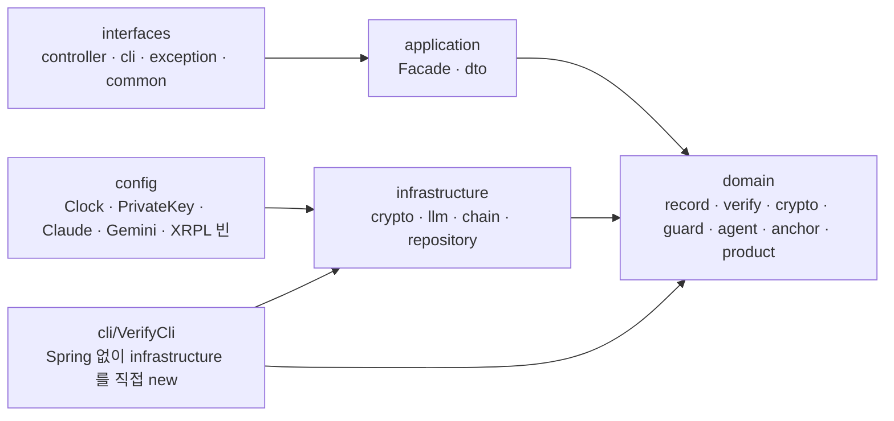

`interfaces → application → domain ← infrastructure`. domain은 SDK를 모른다 — `ChatModel`, `ChainAnchor`, `RecordHasher` 같은 포트만 안다. 검증 CLI는 Spring 컨테이너 없이 `CanonicalJsonHasher`, `Ed25519SignatureVerifier`, `RecordRepositoryImpl`, `XrplChainAnchor.forReadOnly()`를 직접 만들어 `LedgerVerifyService`를 부른다. 그래서 `LedgerVerifyService`에는 `@Service`가 없다.

한 가지 알려진 예외: `ApiException`/`ExceptionCode`가 `interfaces/exception`에 있고 `AnchorService`(domain)와 `XrplChainAnchor`·`ClaudeChatModel`(infrastructure)이 그걸 던진다. 해커톤 규모라 예외 타입을 한 곳에 뒀다. 정석은 domain 예외를 따로 두고 핸들러에서 변환하는 것.

## 테스트

```bash
./gradlew test
```

13개 클래스, **49개 전부 통과** (2026-09-22 확인). 규칙마다 코드를 일부러 망가뜨려 테스트가 실제로 실패하는지 확인했다.

| 클래스 | 개수 | 무엇을 못 박나 |
|---|---|---|
| `LedgerVerifyServiceTest` | 10 | 정상 ok / 내용 수정 → `HASH_MISMATCH` / 삭제 → `SEQ_GAP`+`PREV_MISMATCH` / 복제 → "다시 나옴" / 연속 삭제 범위 문구 / **내부자가 재해시·재서명해도 `PREV_MISMATCH`** / `expectHead` 불일치 → `HEAD_MISMATCH` / 다른 공개키 → 전부 `BAD_SIGNATURE` / 빈 장부 |
| `RecordServiceTest` | 6 | 첫 기록 seq 1·GENESIS·서울 시각·서명 검증 / 3건 체인 연결 / 재기동 후 이어붙임 / **가운데 줄 지운 뒤 붙이면 개수가 아니라 마지막 seq에서** / 빈 head null / `hashBody()`가 칸을 안 섞음 |
| `CanonicalJsonHasherTest` | 4 | 키 순서 무관 / SHA-256 알려진 값(`abc`) / **중첩까지 알파벳순·공백 없음·enum 이름** 정확한 문자열 / 1원 차이로 지문 변경 |
| `Ed25519SignerTest` | 5 | 서명·검증 / 한 글자 차이 false / 다른 키 false / base64 왕복 / 깨진 서명은 예외 대신 false |
| `PaymentGuardServiceTest` | 4 | 권한 없음 / 한도 경계(10000 통과, 10001 차단) / 미등록 가게 / 전부 통과 |
| `AgentToolExecutorTest` | 4 | 검색 위임 / **차단 시도가 장부에 그대로**(agent·attempt·rawRequest) / 허용도 기록 / 두 번이면 seq 1, 2 |
| `AnchorServiceTest` | 3 | head를 가짜 체인에 쓰고 영수증 / 빈 장부 `LEDGER_EMPTY` / 두 번 찍으면 영수증 2건, latest는 두 번째 |
| `RecordControllerTest` | 4 | 실제 HTTP: POST→GET 왕복 / 404 `RECORD_NOT_FOUND` / 음수 금액 400 / 경로 타입 불일치 500 아닌 400 |
| `ToolInputJsonTest` | 3 | Claude `JsonValue` → JSON(자바 Map 표기 아님) / 재파싱 / 따옴표·개행 섞인 입력 저장 왕복 |
| `ToolArgsJsonTest` | 2 | Gemini `Map` → JSON / 빈 인자 `{}` |
| `RecordRepositoryImplTest` | 2 | 파일 없으면 빈 목록 / 두 줄 저장·복원, **`"amount":5980`이 그대로 보여 sed 데모가 먹음** |
| `KeygenCliTest` | 1 | 두 파일 생성, 두 번째 실행은 덮어쓰지 않음 |
| `XrplConfigTest` | 1 | 빈 passphrase 거부 |

LLM API·XRPL 실제 호출은 테스트에 없다 (키·네트워크 필요). 대신 그 경계에서 장부로 들어가는 값(`rawRequest` 직렬화, `ChainAnchor` 포트)을 가짜로 바꿔 검증한다.

## 설계 결정

| 결정 | 왜 |
|---|---|
| **JSONL 파일, DB 없음** | 데모에서 편집기로 열어 한 글자 고치고 새로고침하는 게 핵심 시연. DB면 그 장면이 안 나온다. 한 줄 = 한 기록이라 `sed '2d'`로 삭제 재현도 된다 |
| **`seq`는 마지막 + 1** | 줄 개수로 하면 삭제 후 붙인 기록이 빈 순번을 메워 삭제 흔적이 사라진다 |
| **canonical JSON은 Map으로 변환 후 직렬화** | Kotlin 모듈이 creator 프로퍼티에 순서를 주기 때문에 `SORT_PROPERTIES_ALPHABETICALLY`가 data class에 안 먹는다. Map 경로만 중첩 전부 정렬된다 |
| **서명은 본문이 아니라 `hash` 문자열에** | 검증자가 본문 canonical화를 한 번만 하면 된다. 브라우저처럼 서명 검증을 생략하는 곳도 hash까지는 똑같이 검산할 수 있다 |
| **Ed25519, JDK 내장** | 외부 암호 라이브러리 없이 키 생성·서명·검증. 서명 64바이트, 키 32바이트라 base64 한 줄 |
| **앵커는 head hash 하나** | 기록마다 트랜잭션을 만들면 비용·지연이 기록 수에 비례한다. 체인 덕분에 마지막 지문 하나가 앞 전부를 고정한다 |
| **`AccountSet` + Memo** | 수신자 없이 자기 계정에 메모만 싣는 가장 가벼운 XRPL 트랜잭션. `Payment`처럼 상대 계정이 필요 없다 |
| **계정을 passphrase에서 파생** | 시크릿 파일 없이 환경변수 하나로 항상 같은 주소. 데모 재현이 쉽다 |
| **faucet 자동 충전** | 테스트넷이라 가능. 새 passphrase여도 첫 도장이 알아서 된다 |
| **CLI에 Spring 없음** | "독립 검증"의 증명. 부팅 시간도 짧고, 서버 설정(`application.yml`)을 안 읽는다는 게 눈에 보인다. RPC URL은 그래서 CLI에 박혀 있다 |
| **Gradle 태스크 `isIgnoreExitValue`** | 데모 화면에서 `FAILURE: Build failed`가 `결과:` 줄을 가리지 않게 |
| **`POD_` 접두사 환경변수** | Spring relaxed binding이 셸의 `ANTHROPIC_API_KEY`를 먹어버리는 사고 방지 |
| **AIA 옵션을 `main()`에서** | Gradle `jvmArgs`만으로는 IDE·JAR 실행에서 빠진다. 검증을 끄지 않고 체인을 완성하는 옵션이라 코드에 둬도 안전 |
| **브라우저는 서명을 안 본다** | 공개키를 페이지에 심으면 그것도 서버가 준 값. 서명은 공개키를 따로 받은 CLI가 본다 |
| **에이전트를 공격적으로** | "검색되면 즉시 결제" 시스템 프롬프트. 무단 결제 시도를 매번 재현해야 데모가 된다 |
| **`@Synchronized` append** | 단일 JVM 해커톤 규모. 파일을 매번 다시 읽는 것도 같은 이유 |

## 위협 모델과 한계

무엇을 막고, 무엇은 못 막는지 정직하게.

| 공격자 | 시도 | 결과 |
|---|---|---|
| 파일에 접근한 외부인 (키 없음) | 내용 수정·삭제·복제 | 체인 검사만으로 전부 잡힘 |
| **개인키를 가진 내부자** | k번째부터 끝까지 전부 재작성·재서명 | 체인 검사는 통과. **k 이후에 찍힌 앵커가 있어야** `HEAD_MISMATCH`로 잡힘 |
| 개인키를 가진 내부자 | 마지막 앵커 **이후** 기록만 재작성 | **못 잡는다.** 다음 도장을 찍기 전까지의 창. 자주 찍을수록 창이 좁아진다 |
| 개인키를 가진 내부자 | 끝 줄들 잘라내기 | 마지막 지문이 앵커와 달라 `HEAD_MISMATCH`, 브라우저는 순번 비교로 `missing`. 앵커 이후 줄이면 못 잡는다 |
| 앵커 영수증 파일 삭제 | `data/anchors.jsonl` 제거 | 온체인 트랜잭션은 남는다. 검증자는 익스플로러·계정 히스토리에서 txHash를 찾아 `--anchor-tx`로 넣으면 된다 |
| 가짜 공개키 배포 | 다른 키쌍으로 장부 전체 재작성 + 그 공개키 배포 | **공개키 배포 채널의 신뢰**에 달렸다. 이 프로젝트 범위 밖 |
| AI 회사 | "그 `requestId`는 우리가 발급한 게 아니다" | `requestId`는 상관관계 열쇠지 서명이 아니다. AI 회사가 요청에 서명해 주는 건 협조가 필요한 다음 단계 |
| 서버 시계 조작 | `at`을 과거로 | `at`은 서버 시계. 신뢰할 수 있는 시각은 **XRPL 렛저 확정 시각**뿐 — "늦어도 그 시각에는 이 장부가 존재했다"는 상한만 증명한다 |

그 밖의 범위 제한:

- `rawRequest`는 우리가 직렬화한 도구 입력이지 AI 회사 API의 HTTP 응답 원문은 아니다.
- 상품 카탈로그는 코드에 박힌 3개. 실제 결제 게이트웨이 연동 없음 — `ALLOWED`여도 돈은 안 나간다.
- 단일 JVM·단일 파일. 수평 확장하면 `@Synchronized`가 의미 없어진다.
- 키 회전 없음. 기록에 키 id가 없어서 키를 바꾸면 이전 기록은 이전 공개키로 검증해야 한다.
- 테스트넷. 메인넷으로 옮기려면 faucet을 빼고 실제 XRP가 필요하다.

## 트러블슈팅

| 증상 | 원인 | 해결 |
|---|---|---|
| 기동 실패 `서명 키가 없습니다: keys/ed25519.private — 먼저 ./gradlew keygen` | 키 없음 | `./gradlew keygen` |
| 기동 실패 `XRPL_PASSPHRASE must be configured and non-blank` | 환경변수 없음/공백 | `export XRPL_PASSPHRASE=…` 또는 루트 `application-local.yml` |
| `/agent/chat` → `503 AGENT_NOT_CONFIGURED` | API 키 비어 있음 | `POD_ANTHROPIC_API_KEY` (Claude) 또는 `GEMINI_API_KEY` + `AGENT_PROVIDER=gemini` |
| `/agent/chat` → `502 AGENT_FAILED` | 키 형식 오류, 모델 없음, 네트워크 | 기동 로그의 `Anthropic 키: N자, 형식 …` 확인. 서버 로그에 SDK 예외 |
| `/anchor` → `502 ANCHOR_FAILED` "faucet 충전 후에도 잔액을 확인하지 못했습니다" | 테스트넷 faucet 지연/장애 | 잠시 후 재시도. 첫 도장은 30초쯤 걸릴 수 있다 |
| `/anchor` → `404 LEDGER_EMPTY` | 기록 없음 | `bash demo/seed.sh` 또는 채팅 한 판 |
| `PKIX path building failed` | AIA 옵션 없이 XRPL 호출 | `./gradlew bootRun` / `verifyLedger`는 자동. 직접 `java -cp`로 돌릴 땐 `-Dcom.sun.security.enableAIAcaIssuers=true` |
| CLI `체인에서 지문을 찾지 못했습니다` | 아직 validated 전이거나, 메모 형식이 `pod:v1:`가 아니거나, 다른 계정의 tx | 몇 초 후 재시도. txHash 오타 확인 |
| CLI `장부 줄을 읽을 수 없음 — 형식이 깨졌습니다` | 편집 중 JSON 문법 파괴 | 의도한 시연이면 정상. 아니면 백업 복원 |
| 브라우저 도장 박스 노랑 "다시 찍으세요" | 도장 뒤에 새 기록 | 정상. `다시 찍기` |
| Windows에서 `sed -i ''` 오류 | macOS 문법 | `sed -i '…'` (Git Bash) |
| Gradle `No matching toolchains found for … 21` | JDK 21 없음 | JDK 21 설치 후 `JAVA_HOME` 또는 Gradle toolchain 자동 다운로드 설정 |

## 다음 단계

- **AI 회사 서명** — `requestId` 대신 AI 회사가 요청 본문에 서명한 값을 받아 기록에 넣는다. 요청자 측 부인 방지가 암호학적으로 완성된다.
- **자동 도장** — 일정 주기 또는 N건마다 앵커. "마지막 앵커 이후 창"을 좁힌다.
- **Merkle 루트 앵커** — 여러 장부(여러 서버)를 한 트랜잭션에 묶는다.
- **키 id와 회전** — 기록에 `keyId`를 넣고 공개키 목록을 검증자에게 배포.
- **domain 예외 분리** — `ApiException`을 interfaces에서 빼고 변환 계층을 둔다.
- **springdoc OpenAPI** — `*ControllerInterface`에 어노테이션만 달면 된다.
- **실제 결제 게이트웨이** — `ALLOWED`가 실제 결제로 이어지는 경로.

## 용어집

| 용어 | 뜻 |
|---|---|
| **지문 (hash)** | 기록 본문의 SHA-256. 한 글자만 달라도 완전히 다른 값 |
| **앞 지문 (prevHash)** | 바로 앞 기록의 지문. 이걸 본문에 품어서 체인이 된다 |
| **요약 지문 / head** | 장부 마지막 기록의 지문. 앞 전부를 대표한다 |
| **도장 (anchor)** | head를 우리도 못 고치는 곳(XRPL)에 적어두는 것 |
| **영수증 (AnchorReceipt)** | 도장을 찍은 뒤 남기는 `{seq, hash, txHash, address, anchoredAt}` |
| **GENESIS** | 첫 기록의 prevHash, `0` 64개 |
| **canonical JSON** | 같은 내용이면 항상 같은 문자열이 되도록 정렬·공백 제거한 JSON |
| **결제 가드** | `pay` 도구 호출을 권한→한도→가게 순으로 판정하는 규칙 |
| **한 판** | `POST /agent/chat` 한 번. 세션 id 하나, 도구 루프 최대 6라운드 |
| **`requestId`** | AI 회사 API가 발급한 응답 id. 우리가 만들 수 없는 값 |
| **독립 검증** | 우리 서버에 아무것도 묻지 않고 파일·공개키·공개 RPC만으로 확인하는 것 |

## 해커톤 기간에 새로 구현한 것

전부. 기존 코드 없음. 코드 작성에 Claude Code를 사용했고, 설계·검증 시나리오는 팀이 정했다.
